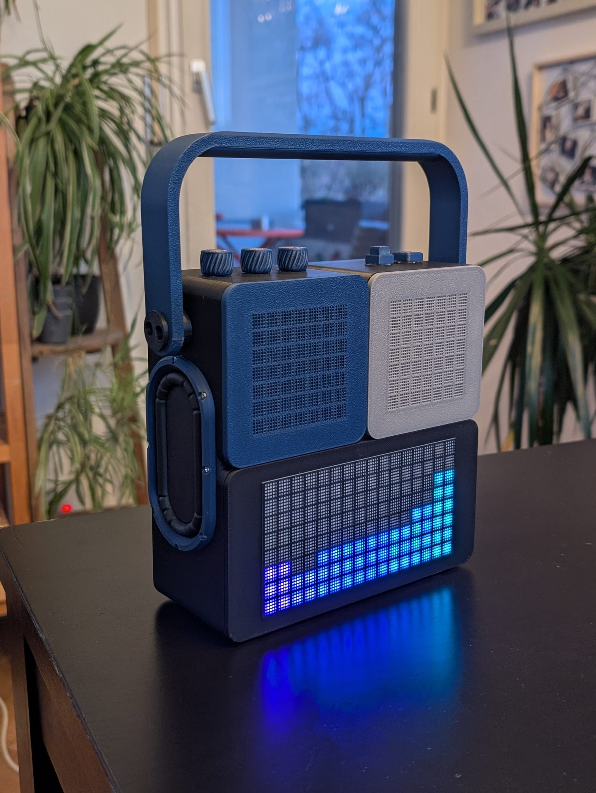
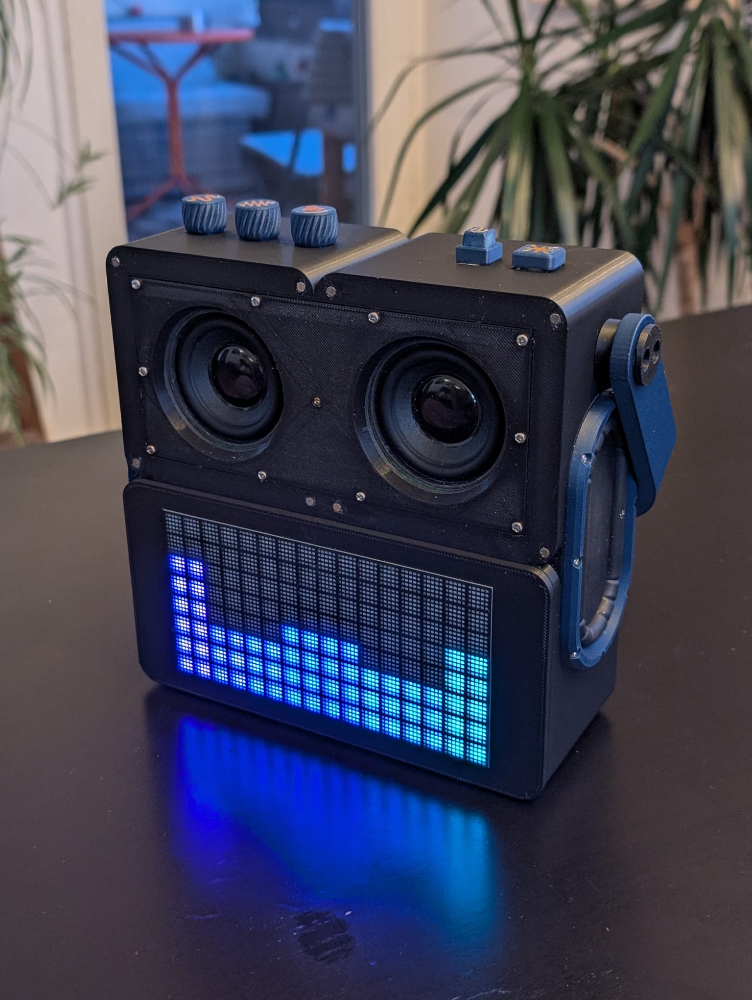
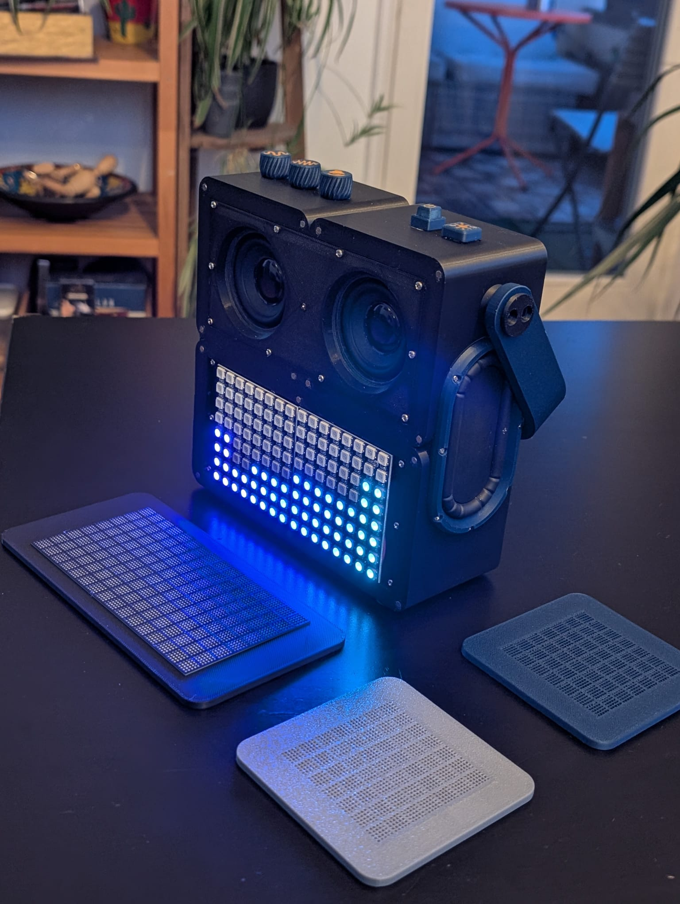

# Garakuta Boombox (ガラクタ)

**ガラクタ** (Garakuta) is Japanese for **"junk"** or **"scrap"** — a fitting name for a self-built speaker made from salvaged and budget parts that sounds anything but junky.

A fully handmade Bluetooth speaker based on the ESP32. The CAD model, electronics, and firmware were all designed and built from scratch.

---

## Photos

| | | |
|:---:|:---:|:---:|
|  |  |  |

---

## Features

- Bluetooth Audio (A2DP Sink), pairs like any regular BT speaker
- Digital equalizer with Bass and Treble via Biquad IIR filters, adjusted live via knobs
- 8-band spectrum analyzer running entirely in software on the ESP32
- 16x8 WS2812B LED matrix with multiple visualization modes
- 3D-printed enclosure with a custom grid front panel for a retro pixel look
- Single-cell Li-Ion battery with a real BMS and boost converter

---

## Hardware

### Microcontroller and Audio

| Component | Details |
|---|---|
| **MCU** | ESP32 (Dual-Core, Xtensa LX6) |
| **Amplifiers** | 2x MAX98357A (I2S Class-D, 3W per channel) |
| **Speakers** | 2x 5W drivers |
| **Passive Radiators** | AliExpress radiators, tuned to the enclosure volume by trial and error |

The ESP32 acts as a pure **A2DP Sink**. It receives the Bluetooth audio stream from a phone as decoded PCM. The digital I2S signal goes directly into the MAX98357A chips, which amplify it internally. No separate DAC was needed.

### Power Supply

| Component | Details |
|---|---|
| **Battery** | 1x 18650 Li-Ion cell (3.7V) |
| **BMS / Charging** | TP4056 + DW01A protection IC (deep discharge protection, charge controller) |
| **Boost Converter** | MT3608, 3.7V to ~5.09V for the amplifiers |
| **Buffer** | Pack of 470uF electrolytic capacitors wired in parallel |
| **Main Switch** | Physical switch that fully disconnects the battery from the booster |

The trickiest part was **clipping**. On heavy bass hits, the MT3608 reacted too slowly and the supply voltage briefly dropped, causing a harsh crackle sound. The fix was soldering a pack of 470uF capacitors directly across VOUT+ and VOUT- of the booster. They absorb load spikes and keep the voltage stable.

### Controls

| Component | GPIO | Function |
|---|---|---|
| Bass Knob | GPIO 33 | Bass +/- 12 dB |
| Treble Knob | GPIO 34 | Treble +/- 12 dB |
| Volume Knob | GPIO 35 | Volume (hard-limited to 70%) |
| Button | GPIO 16 | Short: cycle LED mode / Long (>=1.5s): reconnect |

### LED Matrix

| Parameter | Value |
|---|---|
| Type | WS2812B (NeoPixel) |
| Resolution | 16x8 pixels (2x 8x8 panels chained) |
| Total LEDs | 128 |
| Data pin | GPIO 23 (with 470 ohm series resistor) |

### Full Pin Mapping

| Signal | GPIO |
|---|---|
| I2S DOUT (to MAX98357A DIN) | 32 |
| I2S LRC / WS | 26 |
| I2S BCLK | 27 |
| AMP SD (Mute) | 17 |
| LED Data | 23 |
| Bass Knob | 33 |
| Treble Knob | 34 |
| Volume Knob | 35 |
| Button | 16 |

---

## Software and Firmware

### Bluetooth: A2DP Sink

The ESP32 registers itself via `esp_a2dp_api` as a Bluetooth Classic Audio Sink. The phone sees it as a normal BT speaker and streams decoded PCM directly to the ESP32. Audio data flows through a FreeRTOS ring buffer and is written to the amplifiers in a dedicated I2S writer task.

The Bluetooth device name is **`ガラクタ`**, which shows up on every paired device.

### Digital Equalizer (DSP)

All audio processing happens directly on the raw PCM samples in the I2S writer task, before the data reaches the amplifier:

- **Bass knob** -> Biquad Low-Shelf filter at 120 Hz, slope 0.8, +/- 12 dB
- **Treble knob** -> Biquad High-Shelf filter at 6000 Hz, slope 0.8, +/- 12 dB
- **Volume knob** -> Linear sample scaling, hard-limited to 70% as a safety measure

Biquad coefficients are recalculated on every knob movement. The filter is a Direct Transposed Form II IIR implementation.

### 8-Band Spectrum Analyzer

8 frequency bands are extracted from the PCM stream in real time, with no FFT. Instead, a cascade of simple IIR low-pass filters is used:

- Band 0 is the raw low-pass output (bass region)
- Each higher band is the **difference** between two consecutive low-pass stages
- Band 7 captures everything above all low-pass stages (high frequencies)

This produces a logarithmically spaced frequency spectrum. Band levels are smoothed with an **envelope filter** (fast attack, slow decay), and higher bands are boosted since high-frequency content naturally carries less energy.

### LED Visualizations

A **short button press** cycles through the following modes:

#### Mode 1: Spectrum Bars (VisualizerA)

8 vertical bars, one per frequency band. Bar height follows band energy (sqrt-scaled for better visual balance). Each bar has a color gradient from bottom to top. Bars decay slowly during silence.

#### Mode 2: Plasma (VisualizerC)

A sine-based plasma animation runs across the full 16x8 display. The **animation speed** scales with the current overall audio level, so the plasma runs faster during loud, energetic music.

#### Mode 3: Knob Display

Shows the current position of all three knobs as horizontal bars:
- Row 0-2: Bass (red)
- Row 3-5: Treble (cyan)
- Row 6-7: Volume (green)

This mode activates automatically when a knob is turned and reverts to the previous visualization mode after a short delay.

#### Mode 4: Off

LEDs completely off.

### Intro Text Scroller

On startup, a randomly selected message scrolls across the LED display. Some examples:

> *"GARAKUTA ONLINE."*
> *"GARAKUTA HEISST SCHROTTGERAET FALLS DU ES NICHT WUSSTEST"*
> *"GARAKUTA MAG DICH"*

### Button Functions

| Press | Action |
|---|---|
| **Short** | Cycle to next LED mode |
| **Long (>= 1.5s)** | Bluetooth reconnect + short confirmation melody |

The reconnect melody plays three tones directly over I2S using a software-generated sine wave. No additional audio chip needed.

---

## Enclosure and Optics

The enclosure was fully designed in CAD and **3D-printed**. Internal wiring takes up roughly 30% of the total volume.

The front panel is not a simple diffuser. It is a custom **grid structure** printed to sit physically in front of each individual LED. This creates the optical illusion of sub-pixels, making each LED look like a small window in a cell. The result is a distinctive **retro pixel look** that stands apart from a standard LED matrix display.

---

## Dependencies / Libraries

| Library | Purpose |
|---|---|
| `FastLED` | WS2812B LED control |
| `esp_a2dp_api` (ESP-IDF) | Bluetooth A2DP Sink |
| `driver/i2s_std` (ESP-IDF) | I2S output to MAX98357A |
| `Preferences` (Arduino ESP32) | Persistent settings in NVS flash |
| `FreeRTOS` | Ring buffer and tasks |

---

## License

This is a personal hobby project. Feel free to use it as inspiration for your own builds.
